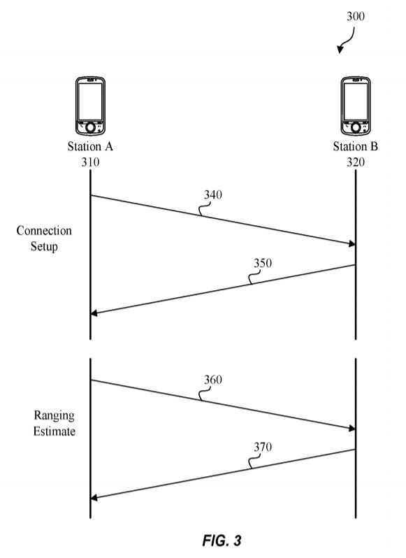

# Ultra-wideband (UWB)

Ultra-wideband is a radio technology which has, as detailed in the IEEE 802.15.4 standard, a number of frequency channels of at least 500MHz wide around the 3-6GHz range. Signalling over a wide frequency range, as opposed to narrowband RF technologies such as WiFi and Bluetooth (2.4GHz), means using a narrow pulse in time-domain. Because of this difference with narrowband signalling, UWB has different characteristics and different potential usecases.

It has greatly developed in the past years. Largely because of the introduction of easy-to-integrate UWB tranceiver chips by [Decawave](https://www.decawave.com/), Bespoon and some others.

# Apple and ultra-wideband

In 2010 Apple filed a patent[^1] detailing discovery service inside Personal Area Networks (PAN). Here, UWB was already mentioned as an alternative for Bluetooh, Zigbee and others.

Now, in 2019, a recent patent[^2] details the use of Bluetooth and UWB for access control systems. It is mentioned that UWB can, with it's narrower pulse width, provide greater accuracy for distance (ranging) measurements.

Another recently submitted patent[^3] concerns only UWB. More specifically the use of pulse shape information in UWB tranceiving setups is detailed. The patent contains, among others, figures of hardware implementations for UWB transceivers and time-of-flight (ToF) schemes. This figure from the paper (Apple's patent FIG. 3) is a clear indication of Apple's considerations for the use of UWB (for ranging) in phones. However, they do also mention that other computing devices may include laptops, desktops, tablets, personal assistants, routers, monitors, televisions, printers, and appliances.

## Why UWB?

But why use UWB? What can it offer, that other technologies can't? For starters, UWB is very different than narrowband RF technologies such as Bluetooth (2.4GHz), Wifi (2.4GHz), 868 MHz, etc. Because of this, UWB has unique characteristics when compared to other technologies. One is not being susceptible to narrowband interference. And there are quite some other unique features and resulting applications.

One application is **highly accurate ranging** or distance tracking. Because of the narrow pulse shape in UWB signalling (or, inversely related, the wide frequency range) a very accurate distance measurement can be calculated using Time-of-Flight (ToF) methods. With positioning algorithms such as trilateration or multilateration, working between different UWB nodes, an accurate position estimate can be calculated. [^4] This makes the technology very useful for Real-time location tracking systems (RTLS). Using RTLS with phones can then allow for accurate **indoor positioning**.

Another one is **secure access control**. Novel techniques including accurate timing and position information in the authentication process, can be key to providing a more secure authentication mechanism between devices.

## The future?

Let's see what will happen with UWB for mobile phones. But as a technology, UWB is certainly a good (better) fit for some applications/problems, such as RTLS or secure access.

[^1]: https://worldwide.espacenet.com/publicationDetails/biblio?DB=EPODOC&II=2&ND=3&adjacent=true&locale=en_EP&FT=D&date=20100930&CC=JP&NR=2010220223A&KC=A
[^2]: https://worldwide.espacenet.com/publicationDetails/biblio?FT=D&date=20190509&DB=EPODOC&locale=en_EP&CC=US&NR=2019135229A1&KC=A1&ND=4
[^3]: https://worldwide.espacenet.com/publicationDetails/biblio?CC=US&NR=2019199398A1&KC=A1&FT=D&ND=3&date=20190627&DB=EPODOC&locale=en_EP
[^4]: https://rtloc.com/technology
